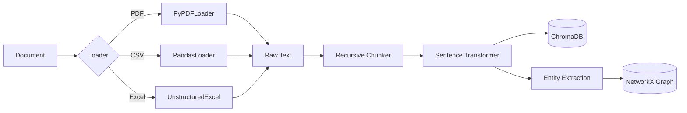
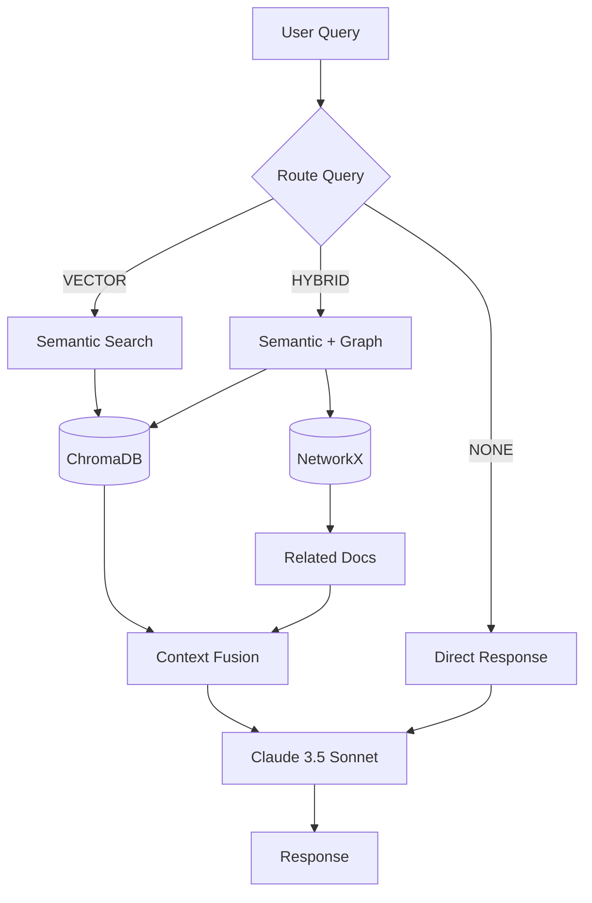
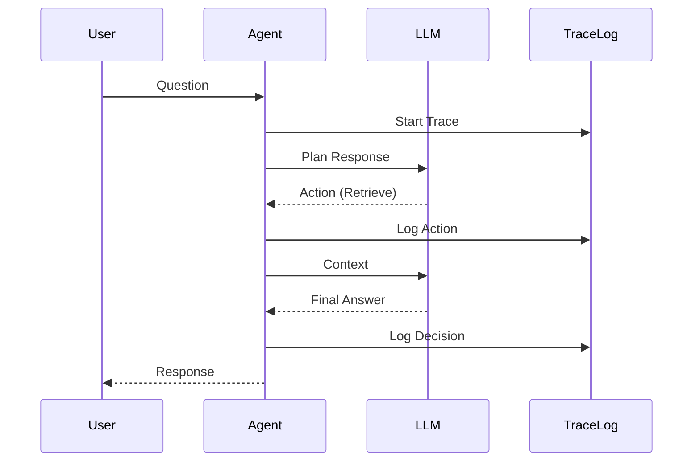

# Data Flow Architecture

## Ingestion Pipeline

The ingestion process converts unstructured documents into structured knowledge.

### 1. Verification & Validation
Incoming files are validated for MIME type and size. We support:
- `application/pdf`
- `text/csv`
- `application/vnd.openxmlformats-officedocument.spreadsheetml.sheet`

### 2. Chunking Strategy
We use a **RecursiveCharacterTextSplitter** with:
- Chunk size: 1000 tokens
- Overlap: 200 tokens
- Separators: `["\n\n", "\n", " ", ""]`

This ensures semantic coherence while fitting within embedding model context windows.

## Retrieval Pipeline

When a user asks a question, we employ a **Hybrid RAG Router** strategy.

### Router Classification

The router (`agent/nodes/router.py`) uses a fast LLM tier (Haiku/Flash) to classify queries:

| Strategy | When Used | Example |
|----------|-----------|---------|
| **VECTOR** | Specific facts, metrics, single-document questions | "What was Q3 revenue?" |
| **HYBRID** | Relational, exploratory, or broad questions | "What tools are related to Slack?" |
| **NONE** | Greetings, general chatter | "Hello" |

### Search Strategies

1. **Semantic Search (VECTOR)**: Top-k (k=5) retrieval from ChromaDB using cosine similarity.
2. **Graph Expansion (HYBRID)**: Semantic search + 1-hop neighbor lookup in NetworkX for co-retrieval patterns.
3. **Context Fusion**: Merging vector results with graph context, deduplicating overlaps.

## Decision & Trace Flow

Every action is logged for observability.

