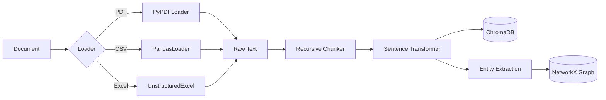
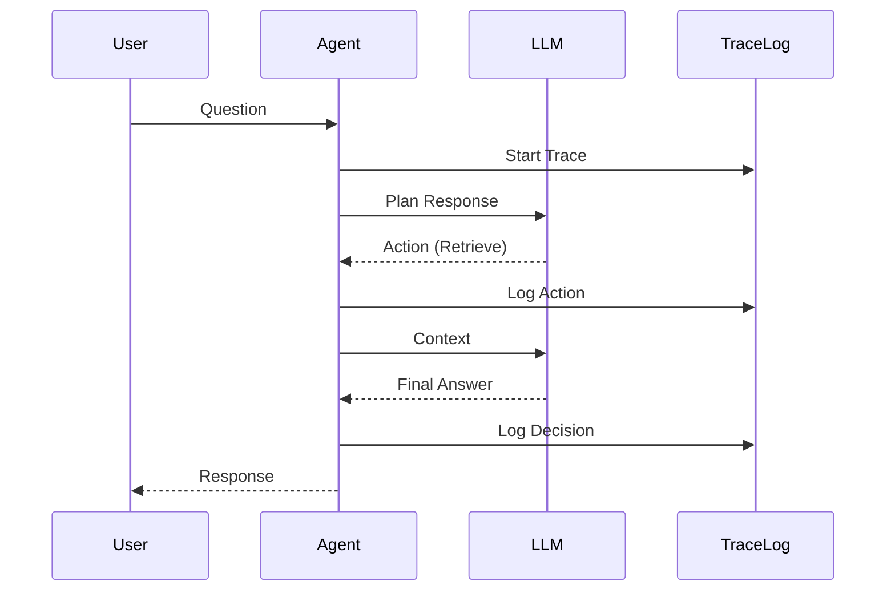

# Data Flow Architecture

## Ingestion Pipeline

The ingestion process converts unstructured documents into structured knowledge.

### 1. Verification & Validation
Incoming files are validated for MIME type and size. We support:
- `application/pdf`
- `text/csv`
- `application/vnd.openxmlformats-officedocument.spreadsheetml.sheet`

### 2. Chunking Strategy
We use a **RecursiveCharacterTextSplitter** with:
- Chunk size: 1000 tokens
- Overlap: 200 tokens
- Separators: `["\n\n", "\n", " ", ""]`

This ensures semantic coherence while fitting within embedding model context windows.

## Retrieval Pipeline

When a user asks a question, we employ a **Hybrid Retrieval** strategy.

1. **Semantic Search**: Top-k (k=5) retrieval from ChromaDB using cosine similarity.
2. **Graph Traversal**: 1-hop neighbor lookup in NetworkX for entities found in the query.
3. **Context Fusion**: Merging vector results with graph context + co-retrieval history.

## Decision & Trace Flow

Every action is logged for observability.

