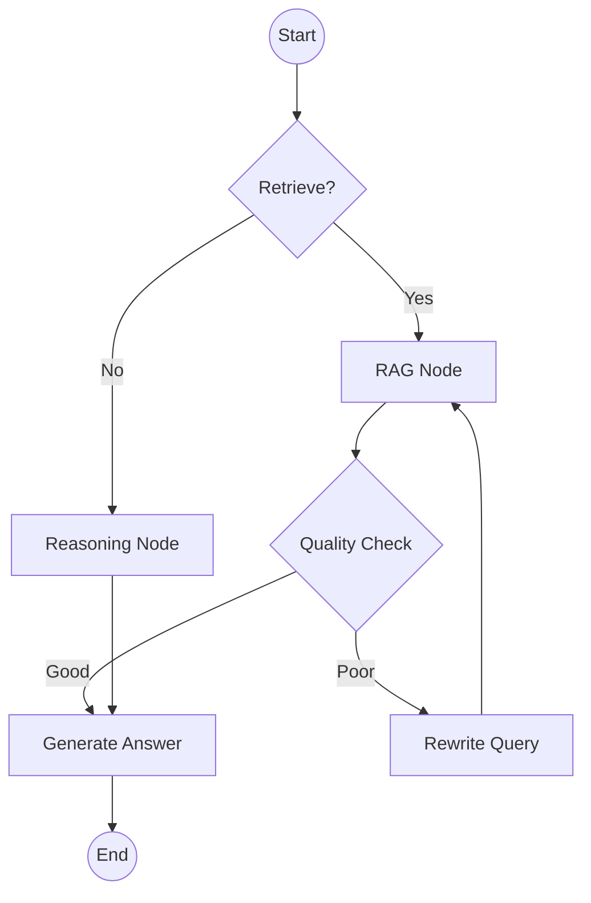

# Decision Engine

OpsOrchestra uses **LangGraph** to model the agent as a state machine, ensuring deterministic and controllable behavior.

## Agent State Graph

The agent is modeled as a cyclic graph:



## Nodes

### 1. Retrieval Node
- **Input**: Query string
- **Action**: Queries ChromaDB and Knowledge Graph
- **Output**: List of `Document` objects with similarity scores

### 2. Reasoning Node
- **Input**: Conversation history, current query
- **Action**: Determines if external data is needed or if the query can be answered from memory.
- **Tools**: `search_knowledge_base`, `lookup_entity`

### 3. Generation Node
- **Model**: Claude 3.5 Sonnet
- **Prompting**: System prompt enforces "Analyst Persona" — concise, data-backed, citations-first.

## Tracing Schema

We use a custom `DecisionTrace` model compatible with OpenTelemetry.

```python
class DecisionTrace(BaseModel):
    trace_id: str
    span_id: str
    parent_id: Optional[str]
    input: str
    output: str
    metadata: Dict[str, Any]
    latency: float
    timestamp: datetime
```

All traces are exported to **Langfuse** for detailed analysis of agent performance.
