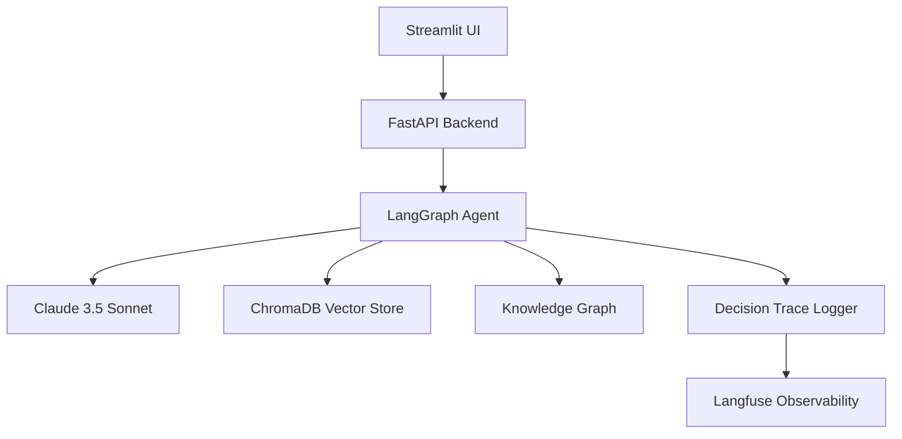

# Architecture Overview

## High-Level Design

## Components

### Agent Layer (LangGraph)

The core intelligence, orchestrating:
- **Retrieval nodes** for document context
- **Reasoning nodes** for response generation
- **Tool nodes** for structured actions

### Document Intelligence

- **Loaders**: PDF, CSV, Excel parsing
- **Chunker**: Recursive character splitting
- **Embedder**: Sentence-transformers
- **Vector Store**: ChromaDB with persistence

### Knowledge Graph (NetworkX)

- **Entities**: Companies, People, Metrics, Tools, Processes
- **Relationships**: Co-retrieval patterns, explicit links
- **Abstraction**: `GraphStore` protocol for future Neo4j migration

## Key Design Decisions

| Decision | Rationale |
|----------|-----------|
| LangGraph over LangChain | Better state management, graph-based flows |
| NetworkX first | Simpler, migrate to Neo4j when triggered |
| Langfuse | Open-source, self-hostable observability |
| ChromaDB | Great for prototyping, production-ready |

## Security & Privacy

OpsOrchestra is designed with **Privacy by Design**:

- **Data Isolation**: Each tenant's data is logically isolated in the vector store.
- **Zero-Retention LLM**: We use Anthropic's zero-retention API options where applicable.
- **Role-Based Access**: (Roadmap) Granular permissions for document access.

## System Constraints

- **File Size**: Max 50MB per document.
- **Context Window**: 200k tokens (Claude 3.5 Sonnet).
- **Latency**: RAG queries avg ~3-5s due to multi-step reasoning.

