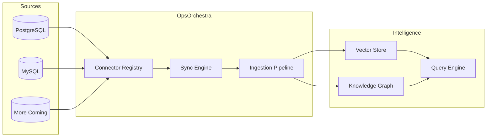

# Data Connectors

OpsOrchestra connects to your operational databases for live data sync. Query your data sources alongside documents for unified business intelligence.

## Overview



## Supported Connectors

| Connector | Status | Features |
|-----------|--------|----------|
| **PostgreSQL** | Available | Full schema discovery, incremental sync, SSL support |
| **MySQL** | Coming Soon | Full schema discovery, incremental sync |
| **MongoDB** | Planned | Collection sync, nested document support |
| **Snowflake** | Planned | Warehouse integration |
| **Google Sheets** | Planned | Spreadsheet sync |

## How It Works

### 1. Connect

Add a data source with encrypted credentials:

```bash
curl -X POST "https://api.opsorchestra.com/v1/connections" \
  -H "Authorization: Bearer YOUR_API_KEY" \
  -d '{
    "name": "Production Database",
    "connector_type": "postgresql",
    "config": {
      "host": "db.example.com",
      "port": 5432,
      "database": "ops_data",
      "username": "readonly_user",
      "password": "secure_password",
      "ssl_mode": "require"
    }
  }'
```

### 2. Discover Schema

OpsOrchestra automatically discovers available tables and columns:

```json
{
  "connection_id": "conn_abc123",
  "tables": [
    {
      "name": "vendors",
      "columns": ["id", "name", "contract_value", "renewal_date"]
    },
    {
      "name": "spend_records",
      "columns": ["id", "vendor_id", "amount", "category", "date"]
    }
  ]
}
```

### 3. Configure Sync

Set up sync rules for selected tables:

| Option | Description | Default |
|--------|-------------|---------|
| **Schedule** | Sync frequency | Manual |
| **Incremental** | Only sync new/changed rows | Yes |
| **Primary Key** | Column for change detection | `id` |
| **Batch Size** | Rows per batch | 1000 |

### 4. Data Flow

Synced records flow through the ingestion pipeline:

1. **Fetch** - Query source database
2. **Transform** - Convert to standard format
3. **Embed** - Generate vector embeddings
4. **Extract** - Identify entities (companies, metrics, etc.)
5. **Store** - Add to vector store and knowledge graph

## Security

<CardGroup cols={2}>
  <Card title="Encryption at Rest" icon="lock">
    Credentials encrypted with Fernet (AES-128)
  </Card>
  <Card title="Tenant Isolation" icon="shield">
    Connections scoped to your organization
  </Card>
  <Card title="Read-Only Access" icon="eye">
    Recommend read-only database users
  </Card>
  <Card title="SSL/TLS" icon="certificate">
    Encrypted connections to databases
  </Card>
</CardGroup>

## API Reference

### Create Connection

```http
POST /v1/connections
```

### List Connections

```http
GET /v1/connections
```

### Test Connection

```http
POST /v1/connections/{id}/test
```

### Discover Schema

```http
GET /v1/connections/{id}/schema
```

### Trigger Sync

```http
POST /v1/connections/{id}/sync
```

### Get Sync Status

```http
GET /v1/connections/{id}/sync/status
```

## Sync Monitoring

Track sync progress in the dashboard:

| Metric | Description |
|--------|-------------|
| **Last Sync** | Timestamp of most recent sync |
| **Records Synced** | Total rows processed |
| **Sync Duration** | Time taken to complete |
| **Errors** | Any sync failures |

## What's Next?

<CardGroup cols={2}>
  <Card title="Document Intelligence" icon="file-magnifying-glass" href="/features/document-intelligence">
    Combine database data with document analysis
  </Card>
  <Card title="Knowledge Graph" icon="diagram-project" href="/features/knowledge-graph">
    See how synced data connects to your entities
  </Card>
</CardGroup>
