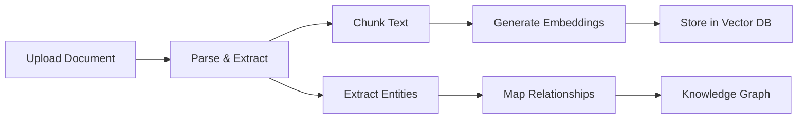

# Document Intelligence

OpsOrchestra transforms unstructured documents into queryable knowledge. Upload PDFs, CSVs, and Excel files to automatically extract entities, relationships, and insights.

## How It Works



## Supported Formats

| Format | Extensions | Capabilities |
|--------|------------|--------------|
| **PDF** | `.pdf` | Text extraction, table detection, multi-page support |
| **Excel** | `.xlsx`, `.xls` | All sheets, formulas resolved, headers detected |
| **CSV** | `.csv` | Automatic delimiter detection, header inference |
| **Text** | `.txt`, `.md` | Direct text processing |

## Entity Extraction

OpsOrchestra uses LLM-powered extraction to identify key entities in your documents:

<CardGroup cols={2}>
  <Card title="Companies" icon="building">
    Vendors, partners, clients, competitors mentioned in your data
  </Card>
  <Card title="People" icon="user">
    Contacts, stakeholders, team members with roles
  </Card>
  <Card title="Metrics" icon="chart-simple">
    KPIs, financial figures, performance indicators
  </Card>
  <Card title="Tools" icon="wrench">
    Software, platforms, systems referenced in operations
  </Card>
</CardGroup>

## Chunking Strategy

Documents are intelligently chunked to preserve context:

| Parameter | Default | Description |
|-----------|---------|-------------|
| Chunk Size | 1000 tokens | Optimal for embedding models |
| Overlap | 200 tokens | Ensures context continuity |
| Boundary | Sentence | Avoids mid-sentence splits |

## Vector Storage

Chunks are embedded and stored in ChromaDB for semantic search:

- **Embedding Model**: OpenAI text-embedding-ada-002 compatible
- **Similarity Search**: Cosine similarity with configurable top-k
- **Metadata**: Source document, chunk position, extracted entities

## Usage

### Upload via UI

1. Navigate to the Documents section
2. Drag and drop files or click to browse
3. Wait for processing to complete
4. View extracted entities in the Knowledge Graph

### Upload via API

```bash
curl -X POST "https://api.opsorchestra.com/v1/ingest" \
  -H "Authorization: Bearer YOUR_API_KEY" \
  -F "file=@document.pdf"
```

**Response:**
```json
{
  "document_id": "doc_abc123",
  "status": "processed",
  "chunks": 45,
  "entities": {
    "companies": ["Acme Corp", "Vendor X"],
    "metrics": ["$50,000 monthly spend", "15% growth"]
  }
}
```

## What's Next?

<CardGroup cols={2}>
  <Card title="Knowledge Graph" icon="diagram-project" href="/features/knowledge-graph">
    See how entities are connected and queryable
  </Card>
  <Card title="Analytics" icon="chart-line" href="/guides/analytics">
    Track KPIs extracted from your documents
  </Card>
</CardGroup>
