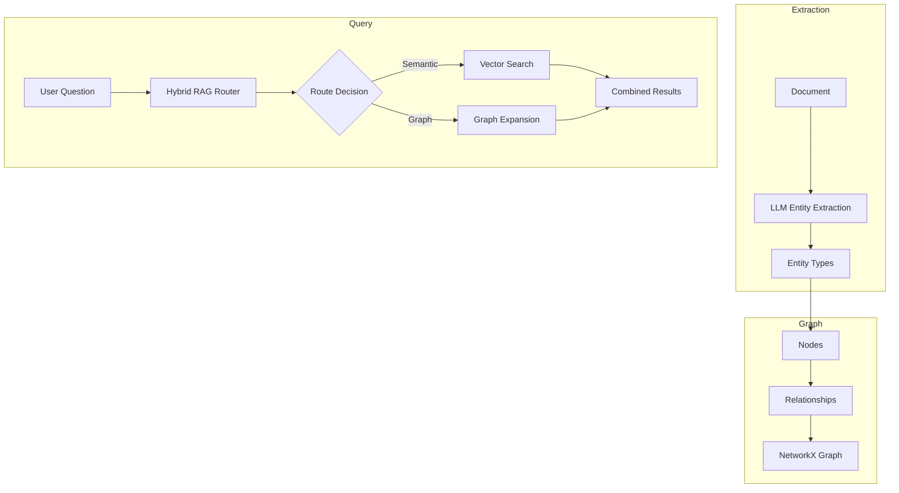

# Knowledge Graph

OpsOrchestra builds a living knowledge graph from your documents and data. Entities are automatically linked, and relationships power intelligent query expansion.

## How It Works



## Entity Types

The knowledge graph tracks five core entity types:

| Entity Type | Description | Example |
|-------------|-------------|---------|
| **COMPANY** | Organizations, vendors, partners | "Acme Corp", "AWS" |
| **PERSON** | Individuals with roles | "Jane Doe (CFO)" |
| **TOOL** | Software, platforms, systems | "Salesforce", "Slack" |
| **METRIC** | Quantifiable measures | "Monthly Revenue", "Churn Rate" |
| **CONCEPT** | Abstract business concepts | "Digital Transformation" |

## Relationship Discovery

OpsOrchestra uses Claude 3.5 Sonnet to discover relationships between entities:

<Accordion title="Example Extraction">

**Source Document:**
> "Acme Corp renewed their contract with Vendor X for $50,000/month. The deal was negotiated by Sarah Chen, our VP of Procurement."

**Extracted Relationships:**
```
COMPANY(Acme Corp) --[CONTRACTED_WITH]--> COMPANY(Vendor X)
COMPANY(Vendor X) --[HAS_VALUE]--> METRIC($50,000/month)
PERSON(Sarah Chen) --[NEGOTIATED]--> COMPANY(Vendor X)
PERSON(Sarah Chen) --[ROLE_AT]--> COMPANY(Acme Corp)
```

</Accordion>

## Hybrid RAG Router

Queries are intelligently routed between semantic search and graph expansion:

| Query Type | Routing | Example |
|------------|---------|---------|
| **Factual** | Vector Search | "What is our contract value with Vendor X?" |
| **Relational** | Graph Expansion | "Who are all the people connected to Vendor X?" |
| **Comparative** | Hybrid | "How does Vendor X compare to Vendor Y?" |

### Graph Expansion

When a query involves relationships, the router:

1. Identifies seed entities in the question
2. Traverses N-hop neighbors in the graph
3. Retrieves connected documents and context
4. Combines with semantic search results

## Graph Queries

### Via Natural Language

Ask relationship questions directly:

- "Who works with Acme Corp?"
- "What tools does the Sales team use?"
- "Show me all vendors with contracts over $10,000"

### Via API

```bash
curl "https://api.opsorchestra.com/v1/graph/query" \
  -H "Authorization: Bearer YOUR_API_KEY" \
  -d '{"query": "MATCH (c:COMPANY)-[:CONTRACTED_WITH]->(v:COMPANY) RETURN c, v"}'
```

## Graph Statistics

View your knowledge graph metrics in the dashboard:

| Metric | Description |
|--------|-------------|
| **Nodes** | Total entities discovered |
| **Edges** | Relationships mapped |
| **Density** | Connection richness |
| **Components** | Isolated subgraphs |

## What's Next?

<CardGroup cols={2}>
  <Card title="Data Connectors" icon="database" href="/features/data-connectors">
    Expand your graph with live database connections
  </Card>
  <Card title="Analytics" icon="chart-line" href="/guides/analytics">
    Track entity-linked KPIs and trends
  </Card>
</CardGroup>
